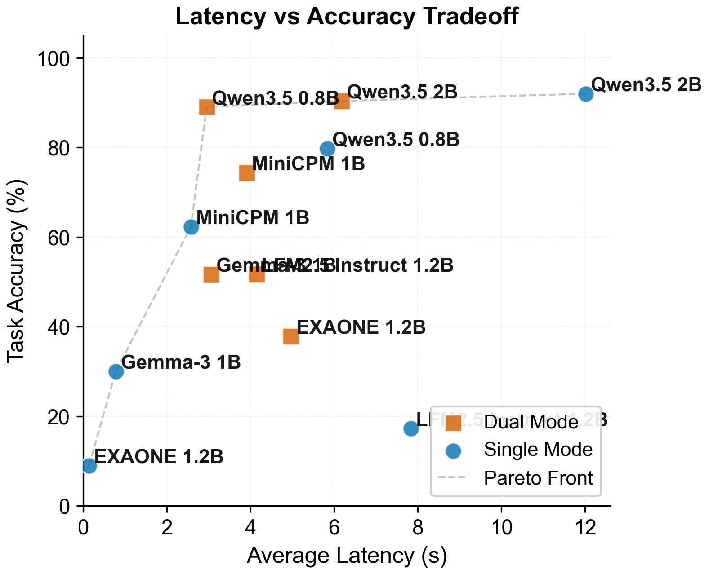
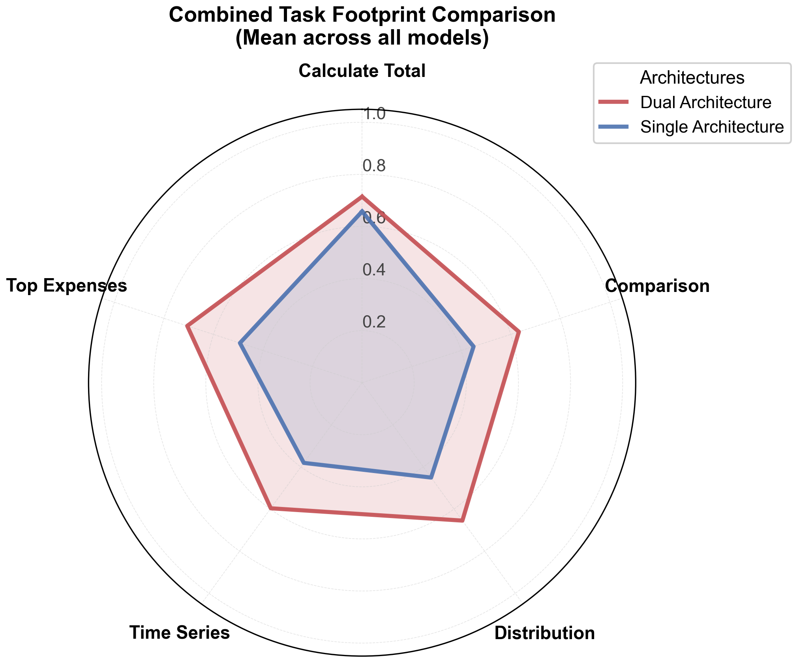
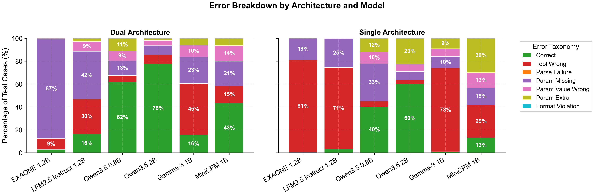
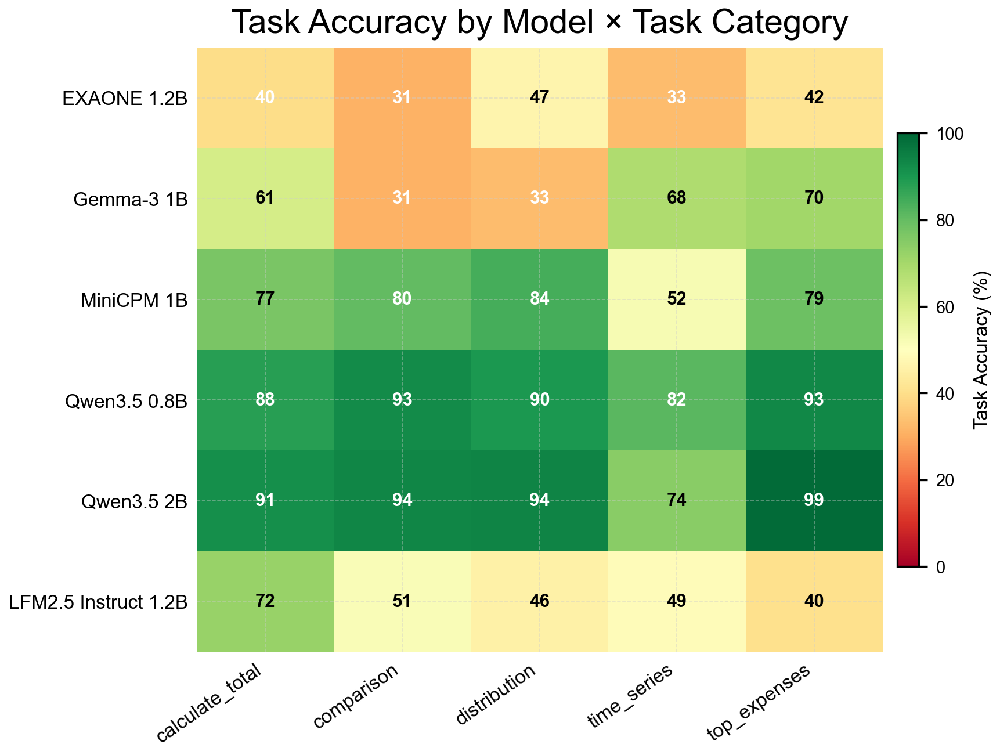
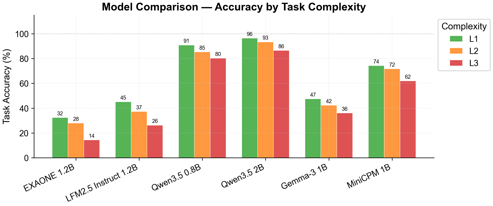
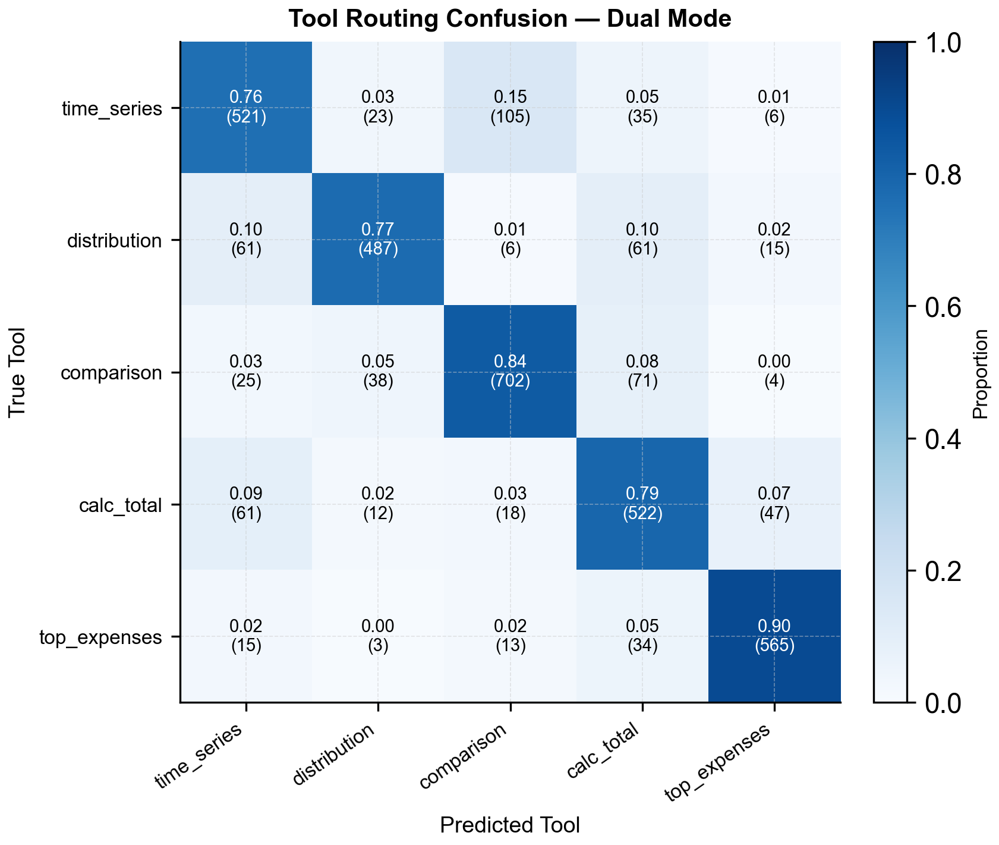
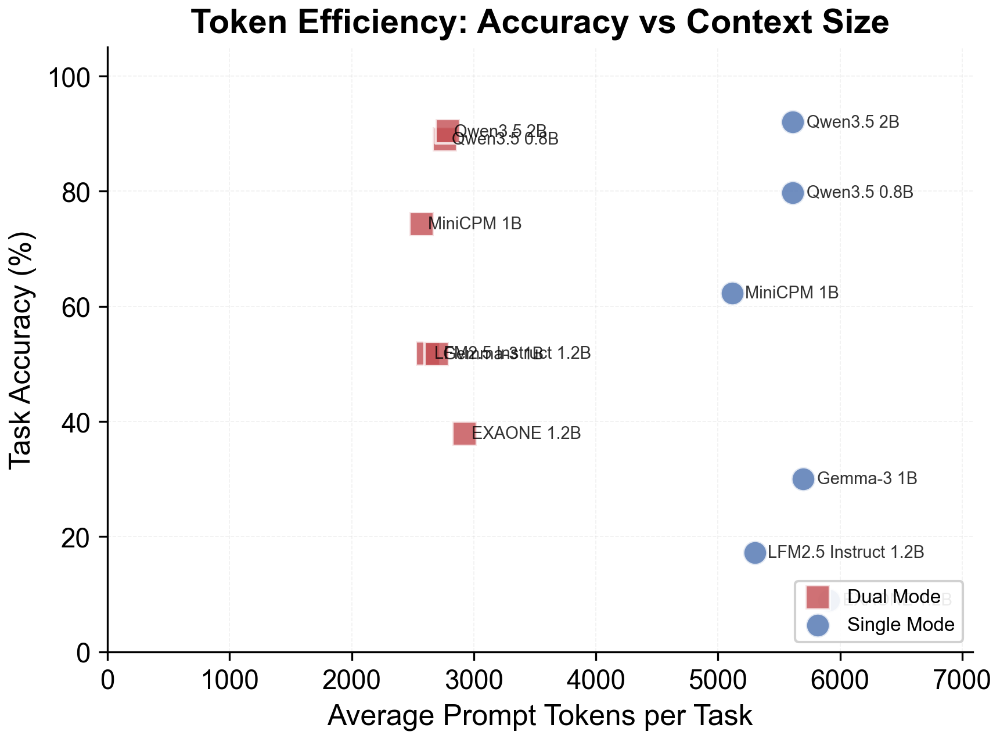

# ExpenseSense: Privacy-Preserving On-Device Personal Finance Tool Calling with Sub-2B LLMs

> **Accepted at the 2nd Workshop on Human-Centered Privacy and Security for Language Models (HAIPS @ COLM 2026)**  
> *Sajag Swami, Yash Pandey* — Independent Researchers

---

## Why On-Device Personal Finance?

Personal finance data—detailed logs of when, where, and how you spend money—is among the most sensitive and intimate data people generate. A simple query like:

> *"How much did I spend on medications and doctor visits last month?"*

is never just a database lookup. When transmitted to cloud-hosted LLM APIs, it reveals sensitive health conditions, lifestyle habits, temporal routines, and financial status to third-party servers with opaque data retention and inference risks. 

**ExpenseSense** investigates whether sub-2B parameter Small Language Models (SLMs) running **entirely on consumer hardware** (such as an 8GB Apple Silicon MacBook) can reliably execute structured analytical tool calls over local financial records—guaranteeing that **zero queries, records, or model outputs ever leave the device**.

---

## Key Architectural Insights

### 1. Dual-Agent Decomposition (Router + Specialist)
Running tool calling on sub-2B models presents a trade-off: single-agent joint extraction requires large prompts (~5.5k tokens) that overwhelm small models. ExpenseSense introduces a decomposed architecture:
- **Router Agent**: Lightweight intent classifier (~1k tokens prompt) predicting canonical tool IDs (1–5).
- **Specialist Agent**: Tool-specific extractor (~1.5k–2k tokens prompt) with focused in-context supervision.
- **Safety Shift**: Dual-agent execution significantly reduces silent, dangerous parameter hallucinations (`PARAM_EXTRA`) in favor of safer omissions (`PARAM_MISSING`).

### 2. Zero-Model-Cost Post-Hoc Validation
A deterministic 4-stage fuzzy matching pipeline (exact match $\to$ morphological normalisation $\to$ edit distance $\to$ Jaccard token overlap) resolves colloquialisms and minor typos (e.g., `"combinis"`, `"nomikais"`, `"groceries"`) without extra LLM passes.

---

## Visual Insights & Benchmark Findings

### Latency vs. Accuracy Tradeoff
Evaluating sub-2B SLMs across single-agent and dual-agent architectures reveals that models like **Qwen3.5-0.8B** and **Qwen3.5-2B** deliver exceptional task accuracy within low-latency and low-RAM budgets on consumer laptops.



---

### Functional Footprint & Tool Coverage
Multi-dimensional radar evaluation across Function Selection, Argument Completeness, Argument Value Correctness, and strict Exact Matches:



---

### Error Taxonomy & Human-Facing Risk Profile
Comparing failure modes shows that dual-agent decomposition effectively suppresses spurious parameter additions (`PARAM_EXTRA`), preventing misleading analytics from being presented to users.



---

### Category Performance & Difficulty Tier Breakdown
Performance evaluated across 30+ expense categories and 3 complexity tiers (L1 simple, L2 moderate, L3 complex multi-constraint queries):

<p align="center">
  
  
</p>

---

### Tool Routing Disambiguation & Token Efficiency
The router achieves high classification precision across analytical tools while keeping prompt overhead minimal:

<p align="center">
  
  
</p>

---

## Repository Structure

```
.
├── README.md                      # Documentation & reproduction guide
├── requirements.txt               # Python package dependencies
├── LICENSE                        # MIT License
└── backend/
    ├── experiments/
    │   ├── expense_benchmark.py   # Main benchmarking runner (single & dual agent)
    │   ├── analyze_plot_benchmarks.py # Publication-quality plot generation script
    │   ├── embedding_baseline.py  # Embedding-similarity baseline (§Router vs. Classifiers)
    │   ├── test_cases.py          # 115 benchmark test cases & complexity scoring
    │   ├── inference.py           # Unified LlamaCpp inference dispatch & KV cleanup
    │   ├── models.py              # Model registry for sub-2B SLMs
    │   └── memory.py              # Memory management for on-device execution
    ├── utils/
    │   ├── tool_registry.py       # Canonical tool ID (1–5) to name mappings
    │   ├── tool_prompts.py        # Specialist prompt templates & few-shot examples
    │   ├── llm_input_validation.py # Post-hoc parameter validation & fuzzy matching
    │   ├── categories.json        # Known expense categories & hierarchical mapping
    │   └── prompts/
    │       └── router_prompt.txt  # Intent classification prompt for router
    └── benchmark_outputs/
        ├── diagnose_failures.py   # Diagnostic script for error distribution & rep stability
        ├── run_5reps_combined.csv # Full raw benchmark dataset (6,900 observations)
        ├── run_5reps_combined.xlsx# Multi-sheet summary tables & bootstrap CI metrics
        ├── run_5reps_dual.csv     # Dual-agent raw observations
        ├── run_5reps_dual.xlsx    # Dual-agent summary workbook
        ├── run_5reps_single.csv   # Single-agent raw observations
        ├── run_5reps_single.xlsx  # Single-agent summary workbook
        └── figures/               # 34 publication figures (Pareto, radar, heatmaps, etc.)
```

---

## Getting Started

### 1. Environment Setup

```bash
# Clone the repository
git clone https://github.com/SunTzunami/ExpenseSense-benchmark.git
cd ExpenseSense-benchmark

# Create and activate virtual environment
python3 -m venv venv
source venv/bin/activate

# Install dependencies
pip install -r requirements.txt
```

For Apple Silicon GPU acceleration (Metal):
```bash
CMAKE_ARGS="-DGGML_METAL=on" pip install --upgrade --force-reinstall llama-cpp-python --no-cache-dir
```

---

### 2. Download Model Weights

Models evaluated use public Q8_0 GGUF quantizations. Download to `backend/models/`:

```bash
pip install huggingface_hub
mkdir -p backend/models

huggingface-cli download LGAI-EXAONE/EXAONE-4.0-1.2B-GGUF EXAONE-4.0-1.2B-Q8_0.gguf --local-dir backend/models/
huggingface-cli download ggml-org/gemma-3-1b-it-GGUF gemma-3-1b-it-Q8_0.gguf --local-dir backend/models/
huggingface-cli download LiquidAI/LFM2.5-1.2B-Instruct-GGUF LFM2.5-1.2B-Instruct-Q8_0.gguf --local-dir backend/models/
huggingface-cli download Abiray/MiniCPM5-1B-GGUF minicpm5-1b-Q8_0.gguf --local-dir backend/models/
huggingface-cli download unsloth/Qwen3.5-0.8B-GGUF Qwen3.5-0.8B-Q8_0.gguf --local-dir backend/models/
huggingface-cli download unsloth/Qwen3.5-2B-GGUF Qwen3.5-2B-Q8_0.gguf --local-dir backend/models/
```

---

### 3. Running Benchmarks

From the `backend/` directory:

```bash
cd backend

# Run complete benchmark (Single & Dual Agent, 5 Repetitions)
python experiments/expense_benchmark.py --mode both --reps 5 --output-dir benchmark_outputs --basename run_5reps

# Run quick test on a single model (1 Repetition)
python experiments/expense_benchmark.py --mode dual --models Qwen3.5-2B-Q8_0.gguf --quick

# Run embedding classifier baseline (requires: pip install transformers torch)
python experiments/embedding_baseline.py
```

---

### 4. Regenerating Figures & Diagnostics

```bash
cd backend

# Generate full figure suite
python experiments/analyze_plot_benchmarks.py \
    --input benchmark_outputs/run_5reps_combined.csv \
    --output benchmark_outputs/figures/

# Run failure diagnosis & stability analysis
python benchmark_outputs/diagnose_failures.py
```

---

## Citation

If you find ExpenseSense useful in your research or applications, please cite our workshop paper and repository:

```bibtex
@inproceedings{swami2026expensesense,
  title={ExpenseSense: Privacy-Preserving On-Device Personal Finance Tool Calling with Sub-2B LLMs},
  author={Swami, Sajag and Pandey, Yash},
  booktitle={2nd Workshop on Human-Centered Privacy and Security for Language Models (HAIPS @ COLM 2026)},
  year={2026},
  note={Non-archival workshop paper}
}

@software{expensesense2026benchmark,
  author={Swami, Sajag and Pandey, Yash},
  title={ExpenseSense: On-Device Personal Finance Tool Calling Suite},
  url={https://github.com/SunTzunami/ExpenseSense-benchmark},
  year={2026}
}
```

---

## License

This project is licensed under the [MIT License](LICENSE).
